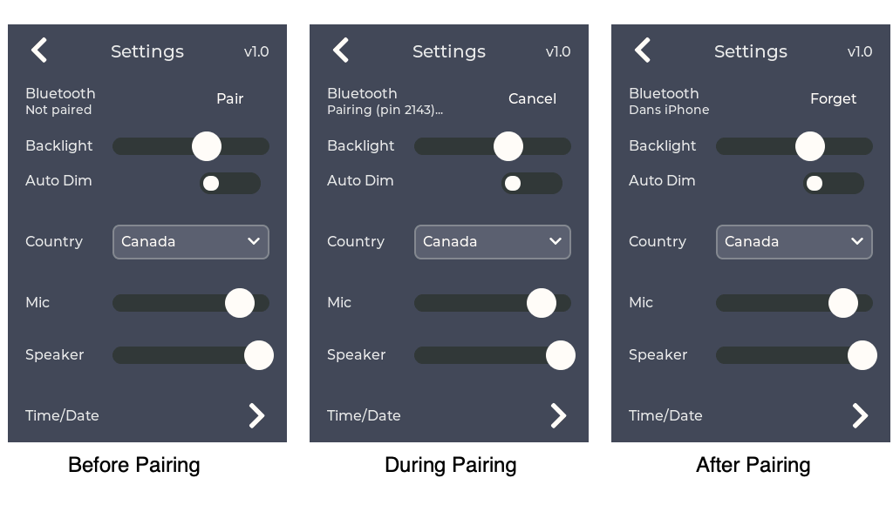

# weeBell Bluetooth Handsfree
This repository contains an open-source ESP32 IDF project to build firmware running on [weeBell](https://github.com/danjulio/weeBell_hardware) that allows traditional POTS telephones to work with a cellphone via the Bluetooth Handsfree protocol.  Incoming calls ring the POTS phone(s) and can be answered on them and the phones can be used to make calls via the cellphone.  The firmware generates various dial tones, ring patterns and Caller ID signaling in the format for multiple countries.  It works with both DTMF and Rotary dial telephones.


The weeBell hardware with this firmware preloaded is available to buy on [tindie](https://www.tindie.com/products/30895/).

## [first] A Shout Out
This project contains a significant amount of audio processing necessary to do things like generate and decode DTMF tones, generate dial tones, encode Caller ID data with Bell 202 or V23 FSK modulation, convert between different samples rates, and, very importantly, implement Line Echo Cancellation (LEC) which is has long been a necessary function of telephone systems that end in a hybrid circuit driving the two-wire POTS telephone electrical connection.  The LEC removes the audio echoed back by the hybrid so the person at the remote end doesn't hear themselves echoed back a few hundred milliseconds after they speak (the time it takes the cellular network to move the audio between two points).  This project was made possible by the discovery of David Rowe's OSLEC echo cancellation code integrated into Steve Underwood's [spandsp (github)](https://github.com/svn2github/oslec) telephony library.  IMHO this library is a thing of beauty (clearly coming from tremendous skill and experience).  Without it I'm not sure I could have ever solved the line echo problem.  A huge thank you to David and Steve, and thanks for putting this up on github so it wasn't consigned to the dustbin of history.

Although not inclusive of the history of [spandsp (Steve's website)](https://www.soft-switch.org/), you can read about David Rowe's experience building OSLEC on his website starting with [this](http://www.rowetel.com/?p=18) post.

What is fun is that code that used to have to run on [then] high-end computer processor or dedicated DSP chips can now run, unmodified, on inexpensive embedded processors like the ESP32.  In fact, an email conversation with David encouraged me to pursue using his code as he felt the ESP32 should be fully capable of running his algorithm.

Of course I continue to be very appreciative of Gabor Kiss-Vamosi and his wonderful open-source [LVGL GUI library](https://lvgl.io/) which made the clean user interface possible.

## Building the project
The project was developed using Espressif IDF v4.4.4 and creates firmware to run on [gCore](https://github.com/danjulio/gCore).  The project is contained in the ```gcore_pots_bt``` directory.  These instructions assume that the IDF is installed and configured in a shell window (instructions at Espressif's [Getting Started](https://docs.espressif.com/projects/esp-idf/en/v4.4.4/esp32/get-started/index.html) web page).

### Configure
The project ```sdkconfig``` is preconfigured with options for the project.  These typically should not need to be changed but it is important to use these configuration items since many optimizations and specific IDF configuration changes have been made.

### Build

```idf.py build```

### Build and load
Connect gCore to your computer and turn on.  It should enumerate as a USB serial device.  You will use the serial port device file name (Linux, OS X) or COM port (Windows) in the command below (PORT).

```idf.py -p [PORT] flash```

or 

```idf.py -p [PORT] flash monitor```

to also open a serial connection after programming so you can see diagnostic messages printed by the firmware to the serial port (```idf.py -p [PORT] monitor``` to simply open a serial connection).

## Loading pre-compiled firmware
There are several easy ways to load pre-compiled firmware into gCore without having to install the IDF and compile.

1. [Easiest] Use the gCore Serial Programmer Desktop application from my [website](https://danjuliodesigns.com/products/gcore.html) to load the firmware onto gCore. See below for links for different desktop platforms.
2. Use the Espressif Windows-only programming tool to load the firmware binaries found in the ```precompiled``` directory here.
3. You can also use the IDF command line tool ```esptool.py``` to load the firmware binaries at the locations shown below if you have it installed.

| Binary File | Load Location |
| --- | --- |
| booloader.bin | 0x1000 |
| partition-table.bin | 0x8000 |
| gcore\_pots_bt.bin | 0x10000 |


### gCore Serial Programmer
Direct downloads for platform-specific gCore Serial Programmer versions may be found at the links below. 

1. [Linux download](https://danjuliodesigns.com/resources/AppSupport/gcore/gsc_0_2_0_Linux_x86_64.zip) - 64-bit x86 architecture version
2. [Mac OS download](https://danjuliodesigns.com/resources/AppSupport/gcore/gsc_0_2_0_macOS.zip) - 64-bit universal (sadly unsigned so you'll have to authorize it manually in System Preferences->Security&Privacy)
3. [Windows download](https://danjuliodesigns.com/resources/AppSupport/gcore/gsc_0_2_0_Windows64.zip) - 64-bit x86 architecture version

The software downloads the current binaries from my website and is a great way to load the latest version of this program (and other gCore demos).

Connect gCore to your computer and switch on.  Open the gCore Serial Programmer and select the associated serial port form the pull-down menu.  Then select ```weeBell Bluetooth``` from the Software List and press Program.  Programming will take about 30 seconds and then gCore should reboot running the weeBell firmware.


### Espressif Programming Tool
You can download the Espressif Programming Tool [here](https://www.espressif.com/en/support/download/other-tools).  Assuming you have downloaded the binary files in the ```precompiled``` directory to your PC, you can use this software as follows.


1. Connect gCore to your PC and turn it on.  After a few seconds Windows should recognize it as a serial device and assign a COM port to it (it is possible you will have to download and install the Silicon Labs [VCP driver](https://www.silabs.com/developers/usb-to-uart-bridge-vcp-drivers)).
2. Start the Espressif Programming Tool.
3. Configure the software with the three binary files and programming locations as shown below.
4. Select the COM port assigned to gCore.
5. Press START to initiate programming.
6. Once programming is complete, press and hold the gCore power button for five seconds to power it off.  Then press it again to power gCore back on.  You should see the weeBell firmware running.


## User Interface

weeBell should display the following screen after loading the firmware.


### Pairing
weeBell Bluetooth uses the classic Bluetooth Handsfree profile to communicate with a cellphone.  Bluetooth must be enabled on the cellphone and weeBell paired with the cellphone.

1. Make sure Bluetooth is enabled on the Bluetooth settings screen on your cellphone.  Leave the settings screen open so you can complete the pairing.
2. Click the Gear icon on weeBell to show the Settings screen.
3. Click Pair on the weeBell Settings screen.  It will enter pairing mode and display a 4-digit PIN as shown below.  You have 60 seconds to complete the pairing before it automatically exits pairing mode.
4. You should see ```weeBell``` show up on your cellphone's Bluetooth screen.  Click it on the cellphone to initiate pairing.
5. Your cellphone will request a PIN code.  Enter the PIN code from weeBell's Settings Screen (below "Bluetooth").
6. Your cellphone and weeBell should complete the pairing.  Your cellphone may ask if you wish to share contacts and call lists.  You can allow or deny this (currently weeBell doesn't request either of these).



### weeBell Screens

#### Main Screen


| Control | Description |
| --- | --- |
| Power | Power status.  Displays battery level and a charge icon when charging. |
| Status | Current device status such as Dialing or Call In Progress. |
| Bluetooth | Displays a Bluetooth icon when connected to a cellphone. |
| Number | Displays phone numbers being dialed or answered. |
| Mute | Mute button.  Mutes audio from the telephone handset microphone when active (red). |
| DND | Do Not Disturb button.  Prevents the phone ringer from ringing when active (red). |
| Keypad | Used to dial when the phone is off hook.  May also be used to send DTMF tones during a call when using a rotary phone. |
| Settings | Display the Settings screen. |
| Dial | Initiates a call or terminates an ongoing call. weeBell will also initiate a call 3 seconds the last digit is dialed from the telephone. |
| Backspace | Deletes the last entered digit (from the Keypad or telephone) when dialing a number. |

The current time and date is displayed when connected to a cellphone but otherwise idle (starting with firmware version 1.0).


#### Settings Screen


| Control | Description |
| --- | --- |
| Back | Return to the Main screen. |
| Bluetooth | Bluetooth pairing control.  Allows pairing and forgetting a pairing.  Displays the currently paired device name. |
| Backlight | Backlight brightness and auto-dim enable.  Enabling Auto Dim causes the backlight to dim after 20 seconds of inactivity.  Any user interface or call activity will return the backlight to the brightness set by the slider. |
| Locale | Sets the device location which customizes the ring, dial tone and other tones generated by weeBell. |
| Volume | Sets the telephone handset microphone and speaker volume. These levels may also be controlled by the cell phone. |
| Set Clock | Display the Set Time/Date screen. |

#### Set Time/Date Screen
This screen is used to set the time and date for use by the Caller ID functionality.  The time and date are are sent to the phone as part of the Caller ID information to timestamp each call.  The correct time is maintained even when weeBell is turned off (as long as a good battery is connected to gCore).


The current digit to be changed is indicated in yellow.  After a digit is entered the current digit to be changed is set to the next digit.  The < key moves back one digit place.  The > key moves forward one digit place.

| Control | Description |
| --- | --- |
| Back | Return to the Settings screen. |
| Time | The time to set in 24-hour HH:MM:SS format. |
| Date | The date to set in MM/DD/YY format. |
| Keypad | Numeric and cursor keys. |
| Set Time/Date | Sets the displayed time and date and returns to the Settings screen. |

## Operation

### Bluetooth connection
weeBell attempts to connect with a paired cellphone once every sixty seconds.

#### Tones
weeBell generates the following dial tones when the handset is off-hook.

1. Dial tone - weeBell is connected a cellphone and capable of making a call.
2. Reorder tone - weeBell is not connected to a cellphone and not capable of making a call.
3. Off-hook tone (Howler) - The handset has been off-hook for a country-specific period of time with no dialing activity.

All tones - as well as ring patterns - are country-specific and controlled by the Locale control.

#### Dialing
weeBell can initiate a phone call through the cellphone in the following ways when the POTs handset is taken off-hook.

1. Telephone number dialed on the POTs rotary dial or DTMF keypad.  weeBell will initiate a phone call 4 seconds after the last digit is dialed so it is important to dial all the digits at once.
2. Telephone number dialed on weeBell keypad followed by Dial button.  The weeBell keypad may also be used to send DTMF tones during a phone call (for example when responding to an auto-attendant while using a rotary telephone).
3. Voice command using cellphone "Hey Siri" or "Hey Google" features.  Dialing 0 on the telephone (or keypad followed by Dial) initiates a voice command.  The functionality must be enabled on the cellphone.  You can issue the voice command after hearing the cellphone-specific prompt in the earpiece.

#### Answering
Incoming calls will cause the POTs telephone to ring (unless Do Not Disturb as been activated).  Picking up the handset will answer the call and route audio to it.

#### Ending a call
A call is ended when the handset is placed back on-hook or the Dial button is pressed on weeBell.  During a call the Dial button turns into a red icon of an off-hook handset.

#### Caller ID
weeBell generates Caller ID (CLIP) information and supports the following standards.

1. Bellcore - Bell 202 FSK modulation following the first ring.
2. ETSI EN 300-659-1 - V23 FSK or DTMF modulation, before or after the first ring, with optional line reversal, DT-AS or RP-AS alerting.
3. SIN227 - V23 FSK modulation with line reversal and DT-AS alerting before the first ring.

It generates Single Data Message Format (SDMF), Multiple Data Message Format (MDMF) and multiple DTMF-encoded data packets.

#### Auto power on
weeBell is designed to be left running constantly using an external USB-C power supply.  It will run from battery power when power fails.  It will automatically turn off when the battery voltage goes below 3.5V to protect the LiPo battery from over-discharge.  In this case it will power-on automatically when external USB power is re-applied.  A typical 2000 mAh battery will provide many hours of runtime.

weeBell can also be turned on and off using the power button on gCore.  Press the power button for about half of a second and release.  When turned off manually, weeBell will not automatically power on when external USB power is (re)applied.

In the case were weeBell firmware crashes then it is possible to turn the device off by pressing and holding the gCore power button for more than five seconds.

#### Error messages
weeBell may display a pop-up dialog box if certain internal errors are detected.  In this case normal operation is suspended and the dialog box prompts to turn weeBell off so the error may be attended to.  The mostly likely cause of this error is if the gCore POTS shield is not [correctly] connected to gCore and the firmware cannot initialize the codec chip via I2C.

#### Persistent Storage
Pairing information is held in gCore's NVRAM.  This memory persists as long as power is applied (from USB or the battery).  Disconnecting the battery will erase the memory and weeBell will have to be paired again.  When repairing, always delete the existing pairing on the cellphone first.

## Supported Countries
The following country list has mostly been selected because I found some of the tones interesting or I wanted to test something.  Additional countries may be added in the ```components/utility/international.c``` file.

| Country | Notes |
| --- | --- |
| Australia | Fun modulated dial tone.  Bellcore Caller ID |
| Europe | Most common 425 Hz dial tone. DT-AS + V23 FSK Caller ID |
| Germany pre-1979 | Fun Morse Code 'A' dial tone.  No Caller ID |
| India | Fun modulated dial tone.  Line Reversal + DTMF Caller ID |
| New Zealand Rev | Supports reversed Rotary Dial telephones.  Bellcore Caller ID |
| United States | My home country :-) We have a good Howler too. |
| United Kingdom | Fun modulated off-hook howler sound.  Line Reversal + DT-AS + SIN227 Caller ID |


## Release Notes

### Release 1.1 - Oct 7, 2023
Bug Fixes

1. Restructure audio_task and improve interface to I2S driver to ensure consistent synchronization between RX and TX paths so we can count on a static alignment of TX/RX data into OSLEC.  Increase OSLEC tail to 32 mSec.
2. Fixed a bug where the Caller ID transmission wasn't cancelled if the user picked  early and it ran after call hung up.
3. Fixed a bug where a race condition between picking up the phone after the first ring could re-trigger Caller ID transmission.  Increased flush buffer to 50 mSec.
4. Fixed a bug in the Caller ID logic where the final long ring of a cadence pair could re-trigger Caller ID transmission.

Functionality

1. Slight mods to code so building with optimization turned on won't cause compiler warnings/errors.
2. Detect more cases where the cellphone might route audio to weeBell outside of a phone call and have weeBell display the right state if the user picks up the phone.
3. Modify ring waveform to return to normal levels between rings to match expected behavior.
4. Set full volume output for Caller ID transmissions and Off-hook tones independent of volume setting.
5. Set Caller ID Mark pre-amble bits correctly for Bellcore and European FSK (spandsp defaults were shorter).
6. Modify bt_task so the local volume takes precedence over the volume sent by the phone when a call is established for outgoing calls.
7. Modify screen dump to be triggered by power button (when compiled in).


### Release 1.0 - Sept 15, 2023
Bug Fixes

1. Display "Call In Progress" status correctly if a call is initiated or answered on the cellphone but audio routed to weeBell and the user picks up the handset.
2. Fixed flicker during backlight dimming and brightening.

Functionality

1. Added support for Caller ID.
2. Added RTC and Time/Date settings screen.
3. Added support for additional countries (see above).
4. Added timeout and ability to suppress off-hook tone for countries in international.c file (internal functionality).
5. Changed screendump trigger mechanism to power button when compiled in (internal functionality).

### Release 0.2 - July 9, 2023
Bug Fixes

1. Correct Ring Frequency off by two calculation (ring was half of desired frequency)
2. Correctly drive RM low at end of ring - some rotary phones would have an off by one error in dialing after ringing.

Functionality

1. Increased time to initiate call after dialing from 3 seconds to 4 seconds.

### Release 0.1 - June 26, 2023
Initial Release
